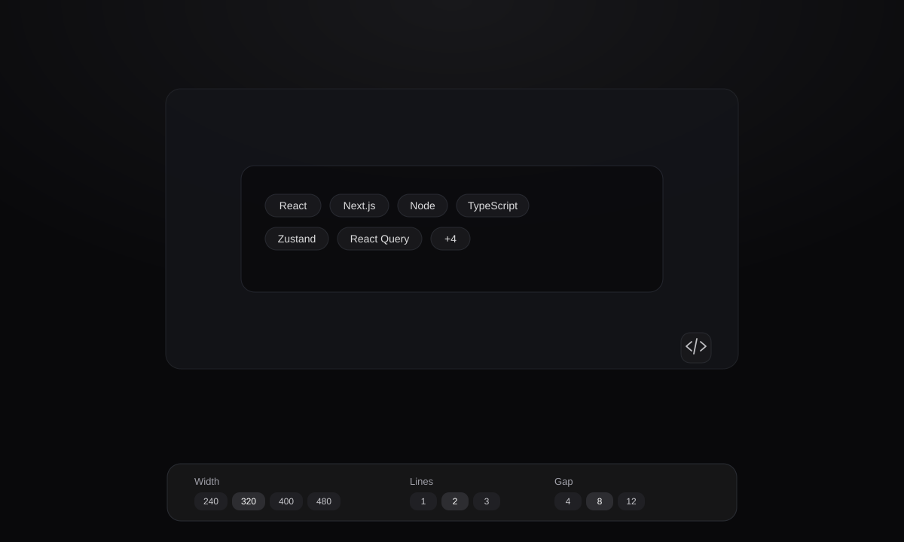

# smart-overflow-group



`smart-overflow-group` is a React component for rendering a horizontal group of items that automatically collapses overflowed content into a `+N` indicator.

It is built for design-system and product UI use cases such as tags, chips, badges, avatars, filters, action pills, and mixed inline items.

## Demo

Temporary demo URL:

`https://demo-url-placeholder.com`

## Features

- Works with React + TypeScript
- Accepts any `ReactNode` as `children`
- Supports single-line and multi-line layouts with `maxLines`
- Uses `ResizeObserver` to react to container changes
- Lets you fully customize the overflow indicator with `renderOverflow`
- Style-agnostic, so it fits existing design systems

## Installation

```bash
npm install smart-overflow-group
```

Required peer dependencies:

- `react`
- `react-dom`

## Quick Start

```tsx
import type { ReactNode } from "react";
import { OverflowGroup } from "smart-overflow-group";

function Tag({ children }: { children: ReactNode }) {
  return (
    <span
      style={{
        display: "inline-flex",
        alignItems: "center",
        minHeight: 30,
        padding: "0 10px",
        border: "1px solid #d4d4d8",
        borderRadius: 999,
        whiteSpace: "nowrap",
      }}
    >
      {children}
    </span>
  );
}

export function Example() {
  const items = ["React", "Next.js", "Node", "TypeScript", "Zustand", "React Query"];

  return (
    <OverflowGroup
      maxLines={2}
      gap={8}
      renderOverflow={(count) => <Tag>+{count}</Tag>}
    >
      {items.map((item) => (
        <Tag key={item}>{item}</Tag>
      ))}
    </OverflowGroup>
  );
}
```

Possible output:

```txt
React  Next  Node
TypeScript  +2
```

## API

### `OverflowGroup`

```ts
type OverflowGroupProps = React.HTMLAttributes<HTMLDivElement> & {
  children: React.ReactNode;
  maxLines?: number;
  gap?: number;
  renderOverflow?: (hiddenCount: number) => React.ReactNode;
};
```

| Prop | Type | Default | Description |
| --- | --- | --- | --- |
| `children` | `ReactNode` | - | Items rendered inside the group |
| `maxLines` | `number` | `1` | Maximum number of visible lines |
| `gap` | `number` | `8` | Spacing between items |
| `renderOverflow` | `(hiddenCount: number) => ReactNode` | `+N` | Custom overflow renderer |

Since the component extends `HTMLAttributes<HTMLDivElement>`, you can also pass:

- `className`
- `style`
- `aria-*`
- `data-*`
- event handlers such as `onClick`

## Exports

The package currently exports:

```ts
import {
  OverflowGroup,
  OverflowItem,
  useOverflowGroup,
} from "smart-overflow-group";
```

Most consumers should use `OverflowGroup` directly.

## How It Works

The component:

- measures the available container width
- measures the rendered children width
- calculates how many items fit within the available lines
- hides overflowing items
- renders an overflow indicator such as `+2`
- recalculates when children, `gap`, `maxLines`, or container size change

## Styling

`smart-overflow-group` is intentionally behavior-focused and style-agnostic.

- It does not require Tailwind
- It does not ship opinionated UI styles for your items
- You control the look of children and the overflow indicator

That makes it a better fit for existing design systems and app-specific UI.

## Best Practices

- Use stable React keys for children
- Keep child width reasonably predictable when possible
- Provide a custom `renderOverflow` to match your design system
- Test with responsive widths if the component is used in dynamic layouts

## Known Notes

- Mixed child types are supported, but visual consistency depends on the children you provide
- The overflow indicator width affects final layout, so custom overflow content should remain visually stable
- This package is currently optimized for client-side React rendering where DOM measurement is available

## Local Development

Install dependencies:

```bash
npm install
```

Start the demo:

```bash
npm run dev
```

Build the library:

```bash
npm run build
```

Build the demo:

```bash
npm run build:demo
```

## Project Structure

```txt
src/
  components/
    OverflowGroup/
      OverflowGroup.tsx
      OverflowItem.tsx
      index.ts
      types.ts
      useOverflowGroup.ts
    demo/
      CodeBlock.tsx
      SegmentButton.tsx
      Tag.tsx
  utils/
    cn.ts
    code-highlight.tsx
    code-snippet.ts
    demo-data.ts
  App.tsx
  demo.css
  lib.ts
  main.tsx
```

## Roadmap

- richer package naming/branding
- automated tests for resize and overflow behavior
- tooltip support for `+N`
- additional accessibility improvements

## License

MIT
